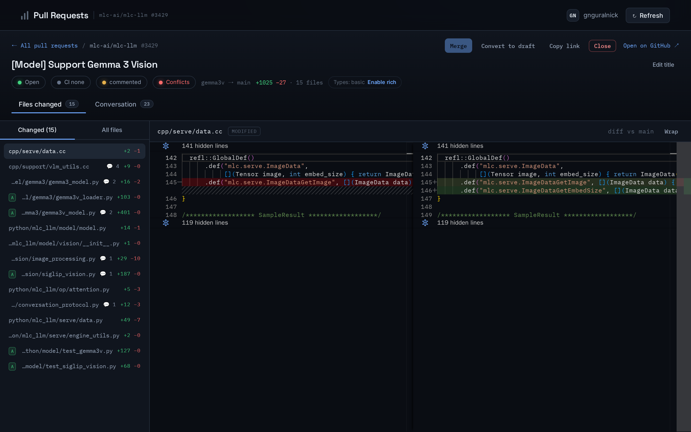
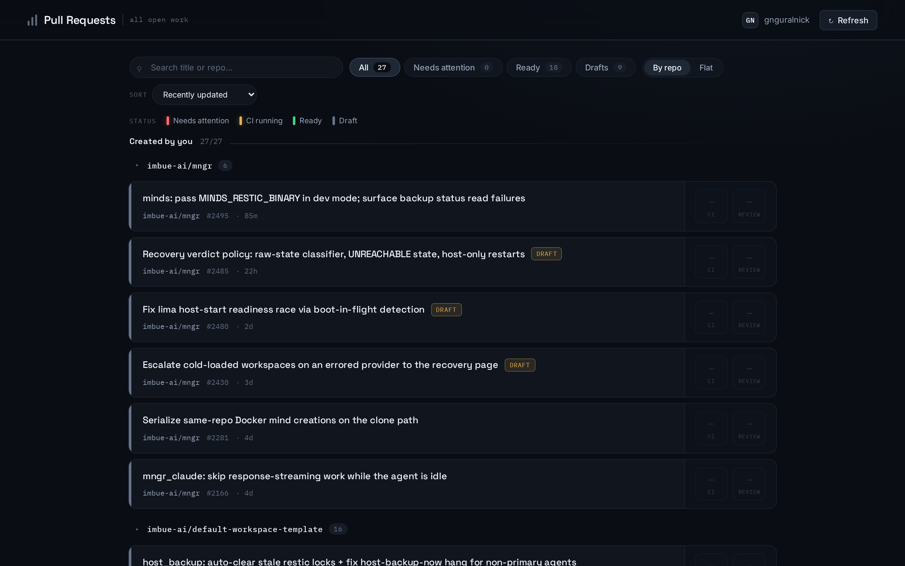
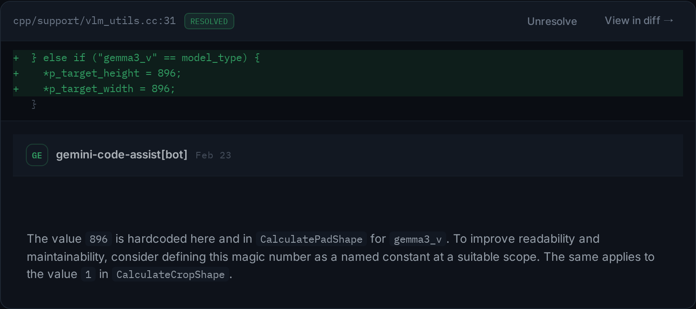

# Code-Aware PR Review

A self-hosted web app for reviewing your own GitHub pull requests with real code
context. GitHub's diff UI shows you the changed lines and little else; this opens
the change inside the whole repository -- full-file diffs, hover and
go-to-definition, and cross-repo find-usages -- so you review with the context
you actually need.

This repository is a **Minds inspiration**: a clean, bootable snapshot of the app
on top of a starter workspace template, published so another Minds workspace can
be created from it and adapt it.

## What it does

- **A dashboard of the PRs that need you** -- your authored and review-requested
  pull requests with CI, review, merge-conflict, and draft status; filter, group,
  sort, and search.
- **A code-aware diff view** -- opening a PR downloads the full repo at the head
  commit and renders each changed file as a full-file diff in a Monaco editor,
  with any file one click away.
- **Code intelligence** -- hover and go-to-definition for Python (Jedi) and
  JavaScript/TypeScript (tree-sitter) with zero setup, plus an opt-in "rich types"
  mode that installs the repo's dependencies to resolve third-party and inferred
  types.
- **Review and act in place** -- comment, submit line-comment reviews, edit the
  title/description, merge, resolve/reopen review threads, and flip a PR between
  draft and ready-for-review.

| PR dashboard | Review-thread resolution |
| --- | --- |
|  |  |

## Using this inspiration

- **Adopt it** into a Minds workspace with the `use-inspiration` skill, pointing
  it at this repository's URL. Start with
  [`inspiration-code-aware-pr-review.md`](inspiration-code-aware-pr-review.md) --
  the manifest that describes what it is, its prerequisites (the GitHub access it
  needs), and how to adapt it.
- **Read the app's own docs** at
  [`libs/pr_review/README.md`](libs/pr_review/README.md) for the full feature and
  architecture details.

> One note on this snapshot: the vendored `mngr`'s non-confidential Google OAuth
> installed-app client secret is blanked for public release. It is unrelated to
> the PR-review app; restore it from upstream `mngr` only if you use the
> Minds-provided Google OAuth client.
